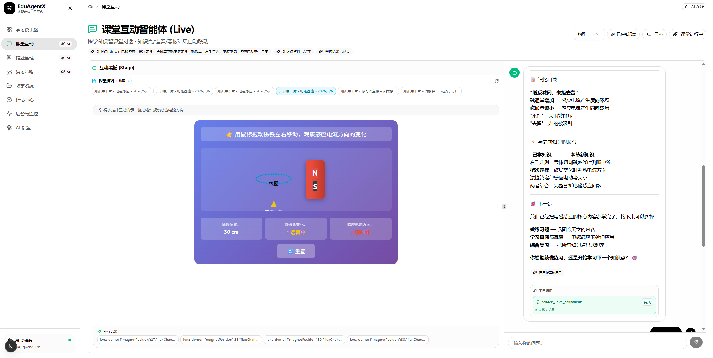
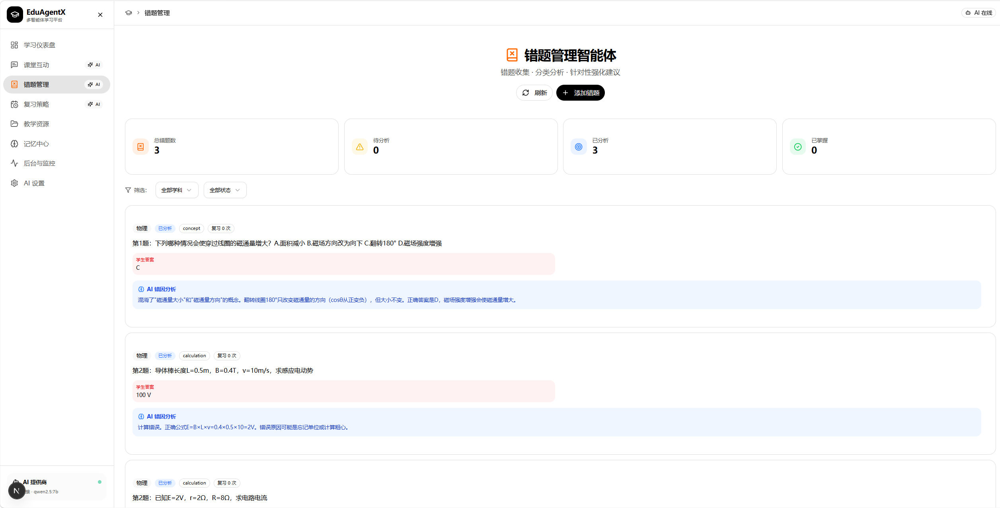
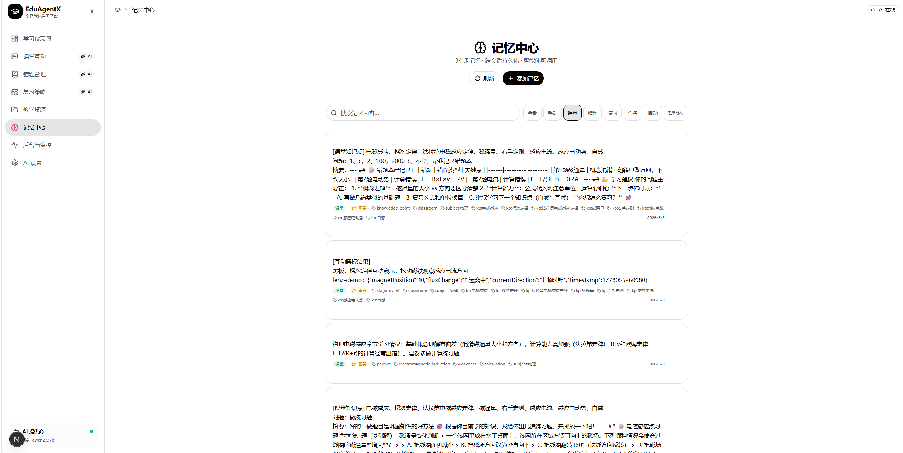
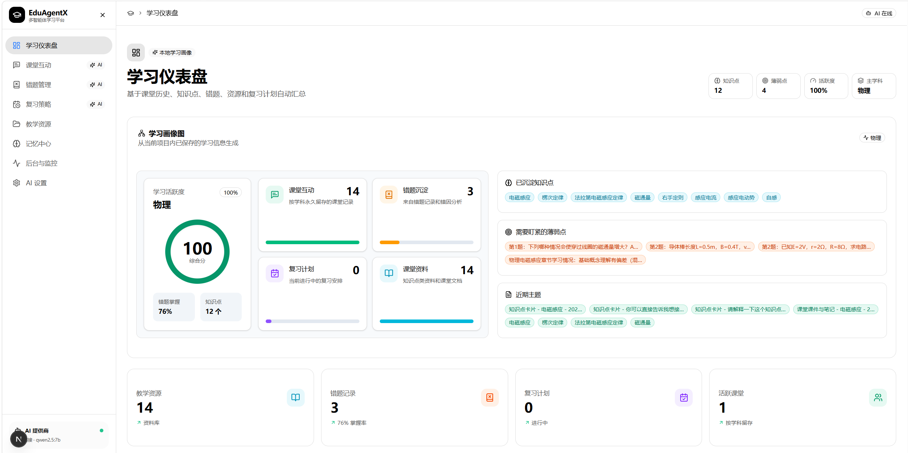
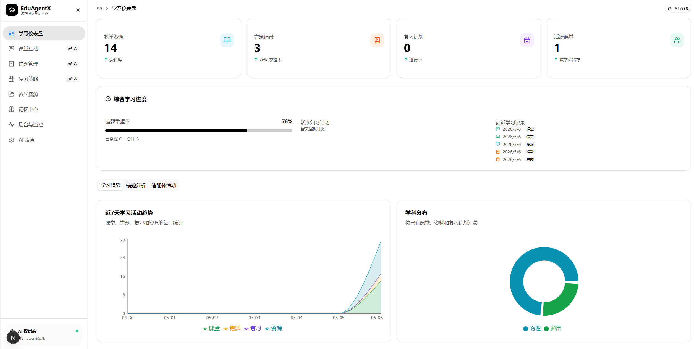

# HeurisAgent

**HeurisAgent** (多智能体启发式学习平台) 是一个基于多智能体协作的启发式学习平台。平台包含课堂互动、错题管理、复习策略三大核心智能体，支持教学资源共享和智能体间的数据协同，旨在提供一个沉浸式、互动性强的自主学习环境。

## 📸 界面预览

这里是平台的部分功能截图展示：











*(注：以上为不同模块的预览图，包括工作台、互动课堂、记忆与复习策略管理等。)*

## ✨ 核心特性

本项目深入结合了多智能体架构（Multi-Agent Architecture）与极致的 UI 设计美学，致力于在学习场景中实现自治、启发与陪伴。

### 1. 多智能体架构与底层协同 (Hermes-Agent Pattern)
- **角色化智能体矩阵**：内置了课堂互动（负责内容引导与即时问答）、错题管理（负责错题解析与举一反三）、复习策略（负责记忆曲线计算与计划排期）三大核心智能体。
- **后台自治执行 (Autonomous Daemon)**：底层采用基于 Hermes-Agent 设计模式的后台守护进程，各智能体能够在没有用户主动触发的情况下，根据 Cron 调度或事件触发进行后台记忆整理、资源分类和数据同步。
- **Function Calling 深度集成**：结合 DeepSeek API 的函数调用能力（Function Calling），智能体不仅能“对话”，更能主动查询数据库、操作 UI 面板、生成教学卡片等，实现真正的“知行合一”。

### 2. 沉浸式分离式互动课堂 (Stage vs. Chat)
- **双模态交互布局**：课堂模块采用了经典的“左侧舞台（Stage）+ 右侧对话（Chat）”布局。当与 AI 交流特定知识点时，左侧可以动态渲染公式、白板图表或图文卡片，右侧保持连续的对话流，打造类似 OpenMAIC 的沉浸感。
- **SSE 流式响应**：通过 Server-Sent Events (SSE) 技术，AI 的思考过程、中间函数调用状态以及最终输出，都会在对话面板与舞台中平滑且无延迟地流式展现，拒绝漫长的 Loading 等待。

### 3. 极简美学设计 (Ollama-Inspired Minimalist Design)
- **克制且纯粹的视觉语言**：平台 UI 深度贯彻了 Ollama 的极简设计哲学。摒弃了所有花哨的投影（Shadows）、渐变色（Gradients）以及复杂的色系。
- **纸白背景与药丸组件**：整个平台像一张纯净的纸张（Paper-white canvas）。所有的交互元素、按钮和标签全部统一为饱满的全圆角“药丸形（Pill-shaped）”组件。
- **色彩与排版（Typography Focus）**：仅保留了极致的黑、白以及三种中性灰（用以区分边框、正文与次要信息）。利用字体的字重与比例搭建信息层级，呈现出犹如精心排版的 Markdown 文档般的视觉享受。

### 4. 记忆持久化与长效状态追踪
- **云端数据同步**：借助 Supabase (PostgreSQL) 强大的关系型数据管理与 Drizzle ORM，智能体在对话中提取的错题、学习偏好等将被结构化持久存储。
- **长期会话记忆**：不仅仅是单次对话，各智能体之间能共享同一份用户画像与学习资源库（Learning Resources / Learning Records 表），从而跨越时间维度，对用户的长期学习轨迹提供连贯性的复习规划与辅导反馈。

## 🛠️ 技术栈

- **框架**: Next.js 16 (App Router) + React 19
- **语言**: TypeScript 5
- **UI 组件**: shadcn/ui (基于 Radix UI) + Tailwind CSS 4
- **数据库**: Supabase (PostgreSQL / Drizzle Schema)
- **AI 驱动**: coze-coding-dev-sdk (豆包 Seed 系列) / DeepSeek API

## 🚀 快速开始

### 环境准备

请确保你已经安装了 `pnpm` (Node.js 包管理器) 以及配置了对应的 Supabase 和大模型 API 密钥 (请参考或复制 `.env.local.example` 创建 `.env.local`)。

### 安装依赖

```bash
pnpm install
```

### 开发环境

运行以下命令启动本地开发服务器：

```bash
pnpm dev
# 或者使用提供的一键启动脚本
.\start.cmd
```

项目将在 `http://localhost:5000` 启动。

### 生产构建

```bash
pnpm build
pnpm start
```

## 🎨 代码风格规范

- 强制 **TypeScript strict** 模式，禁止隐式 `any`。
- 组件强制采用极简扁平化 UI：无阴影、极简黑白配色体系。
- 数据库操作需通过服务端 service_role 访问，结合 Supabase 的 Row Level Security (RLS) 保障数据安全。
- LLM 交互必须显式声明消息角色类型，支持流式交互响应。
